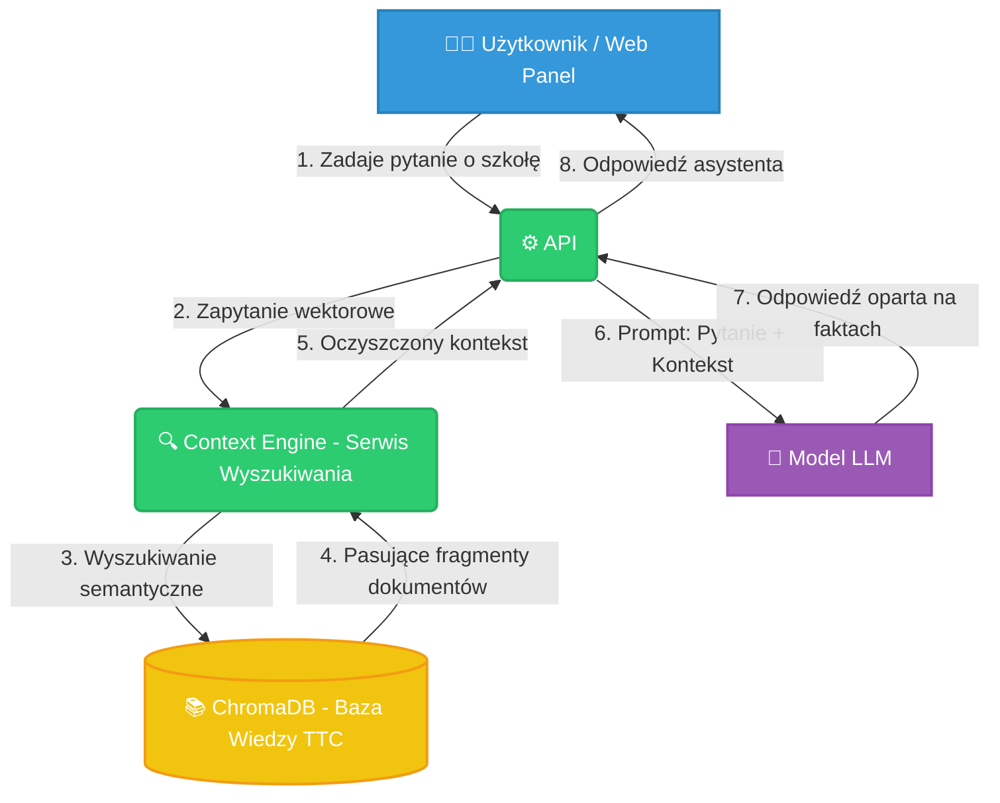
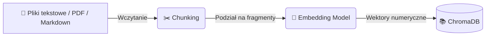

# 🏫 TTC Baza Wiedzy
> **Projekt tworzony w ramach Koła Sztucznej Inteligencji w Technikum Technologii Cyfrowych (TTC) w Szczecinie** 🚀

**TTC Baza Wiedzy** to inteligentny asystent informacyjny oparty na architekturze **RAG (Retrieval-Augmented Generation)**, który umożliwia wyszukiwanie informacji o szkole za pomocą języka naturalnego.

---

## 🎯 Cel Projektu

Celem projektu jest stworzenie **szkolnego asystenta AI**, który będzie odpowiadał na pytania uczniów, nauczycieli i rodziców dotyczące TTC — bez konieczności przeszukiwania wielu stron i dokumentów ręcznie.

Aplikacja składa się z następujących elementów:

1. **Web Panel (Frontend)**
   Czat dostępny przez przeglądarkę, w którym użytkownik zadaje pytania po polsku i otrzymuje precyzyjne odpowiedzi oparte wyłącznie na danych szkoły.

2. **Silnik Kontekstowy (Context Engine)**
   Moduł wyszukujący najbardziej trafne fragmenty z **zamkniętej bazy wektorowej (ChromaDB)** zawierającej dokumenty szkoły.

3. **API AI (LLM API)**
   Serwer zarządzający modelem językowym, który:
   - korzysta wyłącznie z dostarczonego kontekstu o szkole,
   - generuje **rzetelne i konkretne odpowiedzi**,
   - minimalizuje ryzyko halucynacji i zmyślonych informacji.

---

## 🏗️ Architektura Systemu (RAG Pipeline)

Poniższy diagram przedstawia pełen **przepływ danych (Data Flow)** — od momentu wpisania pytania przez użytkownika, aż do wygenerowania odpowiedzi przez model LLM.



---

## 📂 Struktura Repozytorium

```
.
├── frontend/
│   └── Web Panel (interfejs czatu dla użytkownika)
│
├── llm-api/
│   └── Model LLM wystawiony jako API (FastAPI)
│
├── context-engine/
│   └── Silnik wyszukiwania kontekstu (Retrieval + Embeddings)
│
├── knowledge-base/
│   └── Surowe dokumenty i dane o szkole (do indeksowania)
│       ├── ogolne/          # Opis szkoły, historia, misja
│       ├── kierunki/        # Opisy kierunków i specjalizacji
│       ├── plan-lekcji/     # Plany zajęć, dzwonki
│       ├── regulaminy/      # Regulamin szkoły, statut
│       ├── wydarzenia/      # Kalendarz, konkursy, wycieczki
│       └── kontakt/         # Nauczyciele, sekretariat, adresy
│
├── scripts/
│   └── ingest.py            # Skrypt do ładowania dokumentów do ChromaDB
│
├── docs/
│   └── Dokumentacja techniczna projektu
│
└── README.md
```

---

## 🗃️ Co Trafia do Bazy Wiedzy?

Baza wiedzy ChromaDB będzie zawierać **zindeksowane dokumenty** dotyczące szkoły, m.in.:

| Kategoria | Przykładowe dane |
|---|---|
| 🏫 Ogólne | Historia szkoły, misja, wartości, adres |
| 📖 Kierunki | Technik programista, technik informatyk, opisy przedmiotów |
| 🗓️ Plan lekcji | Godziny dzwonków, rozkład zajęć |
| 📋 Regulaminy | Statut szkoły, regulamin ucznia, zasady oceniania |
| 📅 Wydarzenia | Kalendarz roku szkolnego, wycieczki, olimpiady |
| 👩‍🏫 Kontakt | Lista nauczycieli, sekretariat, godziny otwarcia |
| 🖥️ Koła zainteresowań | Opis kół, harmonogram, jak dołączyć |

---

## 🔄 Jak Działa Indeksowanie Dokumentów?



1. **Dodajesz dokument** — np. plik `.txt` z regulaminem szkoły do folderu `knowledge-base/`
2. **Uruchamiasz skrypt** `python scripts/ingest.py`
3. **Dokument jest dzielony** na mniejsze fragmenty (chunki)
4. **Każdy fragment jest zamieniany** na wektor przez model embeddingowy
5. **Wektory trafiają do ChromaDB** i są gotowe do przeszukiwania

---

## 🛠️ Technologie

| Warstwa | Technologia |
|---|---|
| Frontend | React |
| API | Python + FastAPI |
| Embeddings | `sentence-transformers` (lokalnie) |
| Baza wektorowa | ChromaDB |
| Model LLM | (lokalny) |
| Język dokumentów | 🇵🇱 Polski |

---

## 💡 Przykładowe Pytania do Asystenta

- *„O której zaczynają się lekcje?"*
- *„Jakie kierunki oferuje TTC?"*
- *„Kiedy są ferie zimowe w tym roku?"*
- *„Kto jest wychowawcą klasy 3A?"*
- *„Jak zapisać się do koła AI?"*
- *„Jakie zasady obowiązują w regulaminie szkoły?"*

---


---

## 👥 Autorzy

Projekt realizowany przez uczniów **Koła Sztucznej Inteligencji** w Technikum Technologii Cyfrowych (TTC) w Szczecinie.

---

*Masz pytania lub pomysły? Otwórz Issue lub Pull Request! 🙌*
