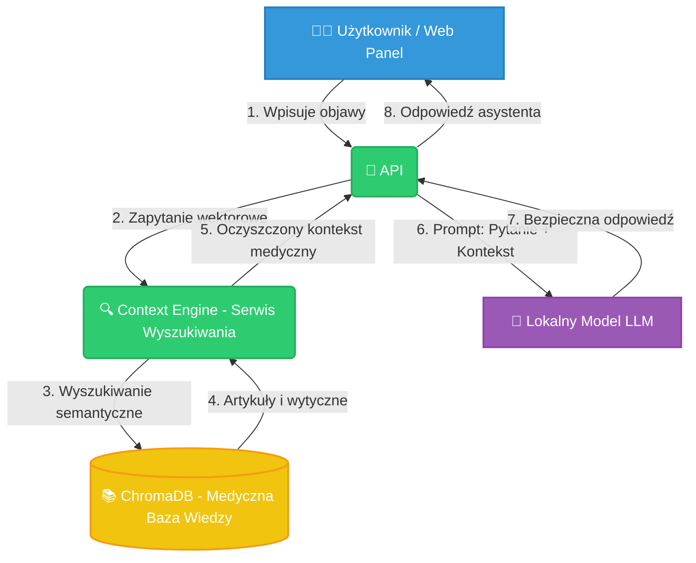

# 🩺 TTC Chatbot Doctor

> **Projekt tworzony w ramach Koła Sztucznej Inteligencji w Technikum Technologii Cyfrowych (TTC) w Szczecinie** 🚀

**TTC Chatbot Doctor** medyczny asystent diagnostyczny oparty na architekturze **RAG (Retrieval-Augmented Generation)**.  

---

## 🎯 Cel Projektu

Celem projektu jest stworzenie **aplikacji medycznej**, składającej się z następujących elementów:

1. **Web Panel (Frontend)**  
   Przyjazny interfejs użytkownika, w którym pacjent może opisać swoje objawy oraz otrzymać odpowiedź w formie czatu.

2. **Silnik Kontekstowy (Context Engine)**  
   Moduł wyszukujący najbardziej trafne artykuły medyczne i wytyczne kliniczne w **zamkniętej bazie wektorowej (ChromaDB)**.

3. **Prywatne API AI (LLM API)**  
   Serwer zarządzający lokalnym modelem językowym, który:
   - korzysta wyłącznie z dostarczonego kontekstu,
   - generuje **bezpieczne i merytoryczne odpowiedzi**,
   - minimalizuje ryzyko halucynacji.

---

## 🏗️ Architektura Systemu (RAG Pipeline)

Projekt został zaprojektowany w architekturze.  
Poniższy diagram przedstawia pełen **przepływ danych (Data Flow)** — od momentu wpisania objawów przez użytkownika, aż do wygenerowania odpowiedzi przez model LLM.



## 📂 Struktura Repozytorium
Obecna struktura repo (w trakcie):
```
.
├── frontend/
│   └── Web Panel (interfejs czatu dla użytkownika)
│
├── llm-api/
│   └── Lokalny model LLM wystawiony jako API (FastAPI)
│
├── context-engine/
│   └── Silnik wyszukiwania kontekstu (Retrieval + Embeddings)
│
├── docs/
│   └── Storage na pliki tymczasowe, pomocnicze  
│
└── README.md
```
